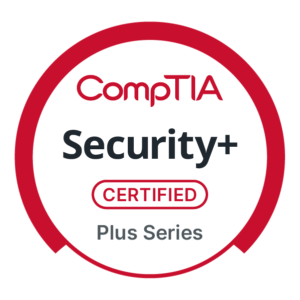
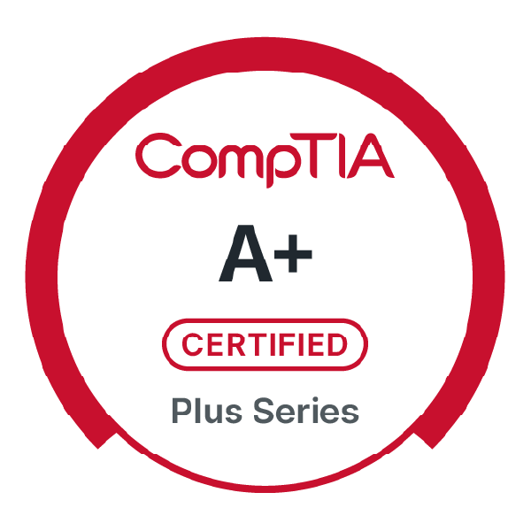

# [Mervin Tabernero](https://www.linkedin.com/in/mervintab/)’s IT & Cybersecurity Project Portfolio 🔐

Welcome to my cybersecurity and IT portfolio! I'm a passionate cybersecurity professional with a background in medical technology, now fully immersed in the world of digital defense. I enjoy solving complex problems through hands-on, practical projects that strengthen security postures and improve operational efficiency.

Here, you'll find a collection of projects that reflect my skills in vulnerability management, threat hunting, scripting, and more. These experiences continue to shape my journey as I pursue a career in cybersecurity—one challenge at a time.

---
## 🏅 Credly Badges (Verified Certifications)

  

  

  

  
  
 ## 🪪 Microsoft Learn Verification
- Microsoft credential verification: https://learn.microsoft.com/api/credentials/share/en-us/MervinTabernero-5158/9F9A5946D154A31A?sharingId=51F966BDC795C705

---

## ⚠️ Vulnerability Management Projects

Projects focused on identifying, prioritizing, and remediating security vulnerabilities across environments.

- 🔧 **[Vulnerability Management Program Implementation](https://github.com/mervintab/vulnerability-management-program)**  
  Designed and documented a structured vulnerability management process using best practices, tools, and frameworks. Covers asset discovery, risk scoring, and remediation workflows.

- 💻 **[STIG Implementation Repository](https://github.com/mervintab/vulnerability-management-program/tree/main/STIG-Implementations)**  
  This repository contains PowerShell scripts and documentation for implementing and remediating DISA STIG requirements on Windows systems. It is intended to support system hardening, compliance auditing, and secure configuration management.
-
## 🚨 Threat Hunting & Security Operations

Hands-on blue team activities focused on proactive detection, investigation, and response.

- 🕵️‍♂️ **[Threat Hunting Scenario: Tor Browser Detection](https://github.com/mervintab/threat-hunting-scenarios)**  
  Participated in a simulated threat hunt to detect anonymized browsing behavior. Used log analysis and detection engineering techniques to identify and investigate suspicious activity.

---

## 🔐 Security Tools & Automation

- 🛠️ **[Firewall Log Analyzer Script](https://github.com/mervintab/scripts-public/tree/main/firewall_log_analyzer)**  
  Parses and visualizes firewall logs to identify anomalies and potential intrusion attempts.

- 📊 **[SIEM Log Ingestion Pipeline](https://github.com/mervintab/siem-log-ingestion)**  
  Built a basic log ingestion setup that simulates log forwarding from endpoints to a SIEM.

- 🐍 **[Log to JSON Parser (Python)](https://github.com/mervintab/scripts-public/tree/main/log_to_json_converter)**  
  A Python script that reads raw log files and converts them into structured JSON format for easier ingestion, analysis, or integration with SIEM platforms. Great for transforming legacy logs into modern formats.

- 🐍 **[The Hive -Docker Installation (Bash)](https://github.com/mervintab/scripts-public/tree/main/theHive-Docker-Install)**  
  A concise, step-by-step guide to installing and running TheHive 5 using Docker and Docker Compose for streamlined incident response deployment.

## 🤝 Let's Connect

I'm always open to collaboration, feedback, or just a good cybersecurity chat! Feel free to reach out:

[][linkedin]  

  

[linkedin]: https://linkedin.com/in/mervintab
