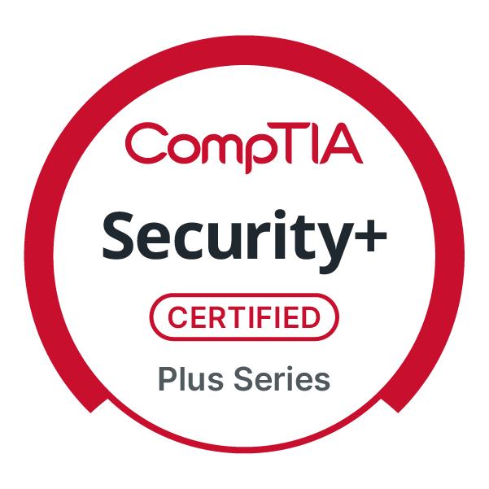
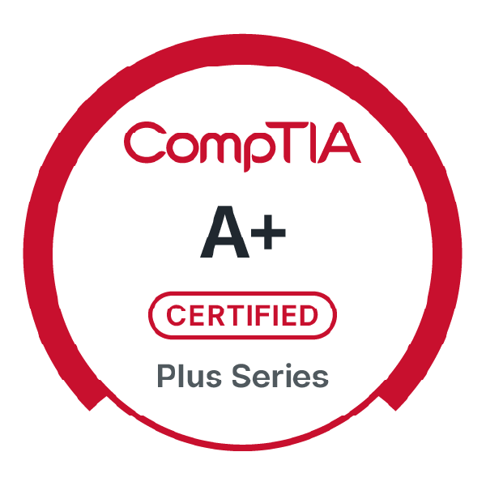
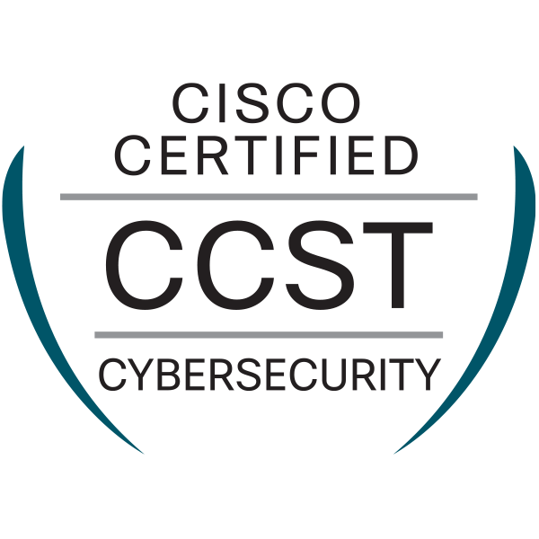
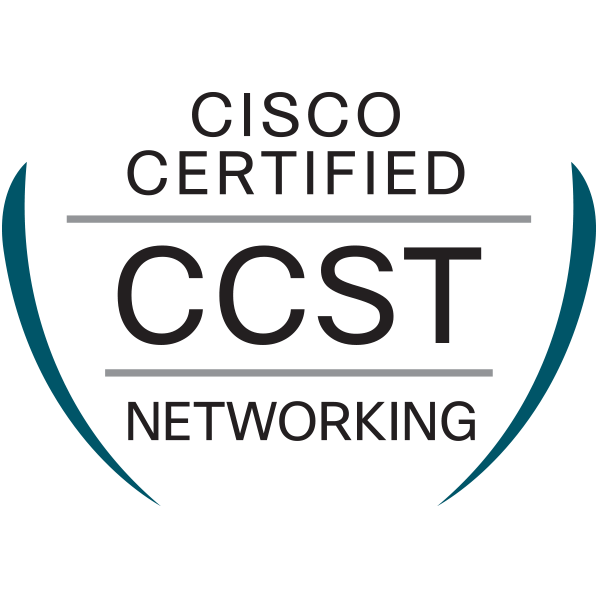
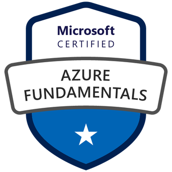

# [Mervin Tabernero](https://www.linkedin.com/in/mervintab/) — SOC Analyst | Cloud Security | Threat Detection 🔐

Welcome to my cybersecurity portfolio! I'm a Security+-certified cybersecurity professional transitioning from a medical technology background into full-time cybersecurity. I specialize in **threat detection, vulnerability management, and security operations**, with hands-on experience building real-world SOC and cloud security labs.

My goal is to contribute to a security team where I can help detect threats, improve defenses, and strengthen organizational security posture.

---

## 🎓 Industry Certifications

## 🏅 Credly Badges (Verified Certifications)

  

  

  

  
  

## 🛠️ Core Security Skills & Tools

**Security Operations:**
SIEM • Threat Hunting • Log Analysis • Detection Engineering • Incident Response

**Platforms & Technologies:**
Azure • Microsoft Sentinel • Splunk • Wazuh • LimaCharlie • pfSense

**Security Practices:**
Vulnerability Management • STIG Hardening • Risk Assessment • Security Automation

---

## 🚨 Featured SOC & Security Projects

---
## 🤖 AI Security Tools & Projects

* 🔍 **[AI-Powered SOC Lab: Splunk + Claude MCP Integration](https://github.com/mervintab/splunk-soc-lab)**
  Built a cloud-hosted SOC lab on Vultr running Splunk Enterprise, integrated with Claude AI via the Model Context Protocol (MCP). Enables natural language threat hunting — no SPL required. Detected and blocked real SSH brute force campaigns within 24 hours of deployment. Secured with Tailscale VPN for multi-device remote access.
  `Splunk` `Claude MCP` `Tailscale` `Vultr` `Threat Hunting` `Ubuntu`

* 🧠 **CWISA Practice Exam GPT**
  AI-powered wireless security certification simulator with dynamic question generation.
  👉 https://chatgpt.com/g/g-698db069762c81918a3f78a371065c7b-cwisa-practice-exam-gpt

### 🔎 Threat Hunting & Detection Engineering

* 🕵️‍♂️ **[Threat Hunting Scenario: Tor Browser Detection](https://github.com/mervintab/threat-hunting-scenarios)**
  Conducted a simulated threat hunt using SIEM log analysis to detect anonymized browsing activity. Applied detection engineering techniques to identify suspicious behavior.

---

## ⚠️ Vulnerability Management Projects

* 🔧 **[Vulnerability Management Program Implementation](https://github.com/mervintab/vulnerability-management-program)**
  Designed and documented a structured vulnerability management process covering asset discovery, risk scoring, and remediation workflows.

* 💻 **[STIG Implementation Repository](https://github.com/mervintab/vulnerability-management-program/tree/main/STIG-Implementations)**
  PowerShell scripts and documentation supporting DISA STIG compliance, system hardening, and secure configuration management.

---

## 🔐 Security Tools & Automation

* 🛠️ **[Firewall Log Analyzer Script](https://github.com/mervintab/scripts-public/tree/main/firewall_log_analyzer)**
  Parses firewall logs to identify anomalies and potential intrusion attempts.

* 📊 **[SIEM Log Ingestion Pipeline](https://github.com/mervintab/siem-log-ingestion)**
  Built a simulated log forwarding pipeline for SIEM ingestion.

* 🐍 **[Log to JSON Parser (Python)](https://github.com/mervintab/scripts-public/tree/main/log_to_json_converter)**
  Converts raw logs into structured JSON for SIEM integration.

* 🐍 **[The Hive -Docker Installation (Bash)](https://github.com/mervintab/scripts-public/tree/main/theHive-Docker-Install)**
  Step-by-step guide for deploying TheHive 5 using Docker.

---

## 🤝 Let's Connect

I'm always open to collaboration, mentorship, and cybersecurity opportunities.

[][linkedin]

  

[linkedin]: https://linkedin.com/in/mervintab
